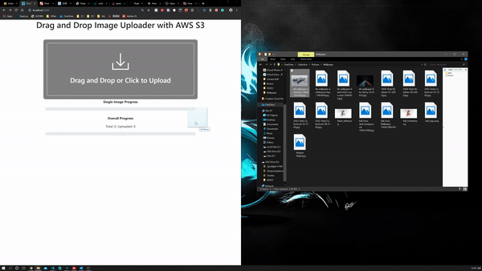
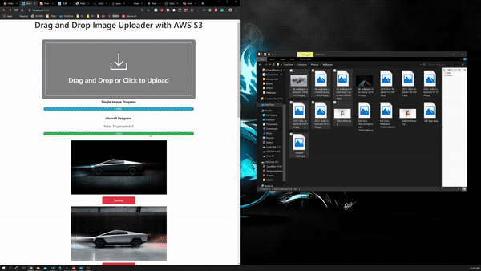
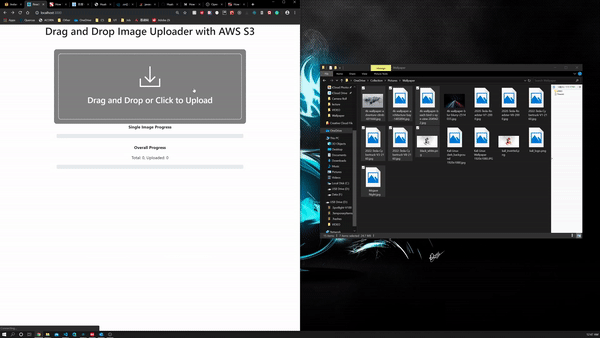
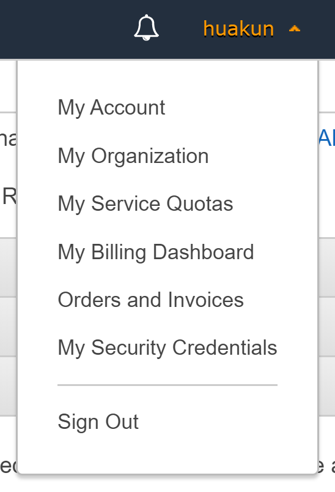

# Drag-and-Drop-Image-Uploader-With-AWS-S3

## Intro

**Using**

- Nodejs + Express for backend
- react for front end
- AWS S3 for File Storage

## Demo and Functions

**Highlight when files are dragged over**


**Upload a single file with Drag-and-Drop**



**Upload multiple files with Drag-and-Drop**


**Delete Images, not synced to S3 Bucket Yet**



**Upload a files with regular `<input />`**



## config

Create a `.env` in the outmost directory, follow the following pattern (also in `.env_template`):

```
accessKeyId=
secretAccessKey=
region=
Bucket=
```

`accessKeyId` and `secretAccessKey` can be created in AWS console, from my secret credentials, Access keys.



`region` can be found in S3's bucket list,


in this example, `region` is `us-east-2`, and `Bucket` is `test-upload-huakun`.
